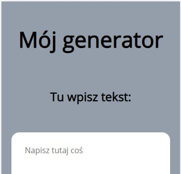

# Simple-editor

Its a tool to send your text to local storage. After you refresh the page you can still obtain back our text.

To check out the project click here ->https://arturciepielowski.github.io/Simple-editor/
